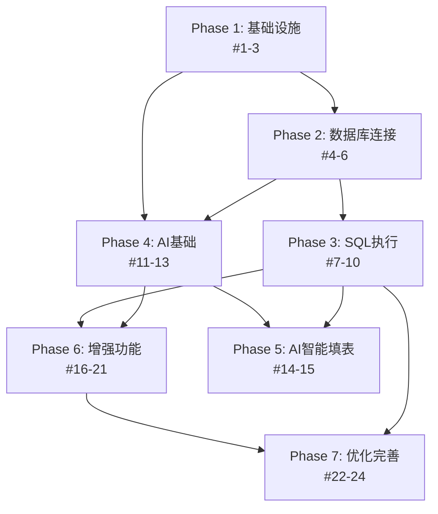

# 数据库管理软件 - 项目概要

**来源文档**: [实施任务清单](superpowers/tasks/implementation-tasks.md)  
**创建日期**: 2026-06-13  
**项目周期**: 6-7 周

---

## 项目定位

AI 驱动的数据库管理工具，核心特色是：
- **自然语言转 SQL**：通过 AI 理解用户意图生成查询语句
- **智能填表**：AI 辅助新增数据和填充 NULL 值
- **Markdown 解析入库**：从文档快速提取数据导入数据库

---

## 技术栈

### 后端
- **框架**: Spring Boot 3.2.5 + Java 21
- **数据访问**: Spring JDBC + HikariCP (连接池)
- **元数据存储**: SQLite

### 前端
- **框架**: Vue 3 + TypeScript + Vite
- **UI 组件**: Element Plus
- **代码编辑器**: Monaco Editor

### 支持的数据库
- PostgreSQL (生产环境)
- SQLite (业务库 + 元数据库)

---

## 核心架构

### 1. 认证系统（双模式）
- **生产模式**：JWT Token 验证
- **开发模式**：简易 userId 输入（`app.auth.debug-mode=true`）

### 2. 元数据管理
内置 SQLite 数据库 (`{应用目录}/data/metadata.db`) 存储：
- 数据库连接配置 (AES-256 加密密码)
- AI 配置 (API Key、模型参数)
- SQL 执行历史
- SQL 片段库
- AI 对话历史
- Markdown 上传记录

### 3. 动态数据源
- 基于 ThreadLocal 实现 `userId:connectionId` 隔离
- HikariCP 连接池管理
- 支持多数据库类型连接切换

### 4. AI 集成
- 自然语言 → SQL 生成（schema 感知）
- 多轮对话优化（conversationId 管理）
- 智能填表（INSERT/UPDATE 辅助）
- Markdown 文档解析入库

---

## 功能模块分解

### Phase 1: 基础设施 (P0)
**任务数**: 3  
**预计时间**: 与 Phase 2 共 1 周

- [#1] 项目脚手架搭建
- [#2] JWT 认证 + 开发调试模式
- [#3] 内置 SQLite 元数据库初始化

### Phase 2: 数据库连接 (P0)
**任务数**: 3  
**预计时间**: 与 Phase 1 共 1 周

- [#4] PostgreSQL 连接管理（端到端）
- [#5] SQLite 业务库连接
- [#6] 连接列表 + 切换

### Phase 3: SQL 执行 (P0)
**任务数**: 4  
**预计时间**: 1 周

- [#7] Monaco Editor 集成 + 手动执行
- [#8] SQL 智能提示（schema 感知）
- [#9] 危险操作检测 + 二次确认
- [#10] 查询结果分页

### Phase 4: AI 基础 (P1)
**任务数**: 3  
**预计时间**: 与 Phase 5 共 2 周

- [#11] AI 配置管理
- [#12] 自然语言转 SQL
- [#13] AI 对话历史 + 多轮优化

### Phase 5: AI 智能填表 (P1)
**任务数**: 2  
**预计时间**: 与 Phase 4 共 2 周

- [#14] 智能填表 - INSERT 新数据
- [#15] 智能填充 NULL - UPDATE 已有数据

### Phase 6: 增强功能 (P2)
**任务数**: 6  
**预计时间**: 1-2 周

- [#16] Markdown 文档解析
- [#17] 复杂类型解析 (JSON/YAML/XML)
- [#18] 结果导出 (CSV/Excel)
- [#19] SQL 执行历史
- [#20] SQL 片段管理
- [#21] EXPLAIN 执行计划分析

### Phase 7: 优化和完善 (P2/P3)
**任务数**: 3  
**预计时间**: 1 周

- [#22] 多标签页管理
- [#23] 连接池监控 + 空闲超时释放 ⚠️ **HITL**
- [#24] 虚拟滚动 + 大结果集优化

---

## 关键设计特点

### 1. 安全性
- ✅ 密码 AES-256 加密存储
- ✅ 危险 SQL 操作二次确认（DELETE/DROP/TRUNCATE）
- ✅ Spring Security 集成
- ✅ 用户级别数据隔离（userId:connectionId）

### 2. 性能优化
- ✅ HikariCP 连接池复用
- ✅ 查询结果分页（LIMIT/OFFSET）
- ✅ 虚拟滚动支持 10,000+ 行流畅展示
- ✅ 30 分钟空闲自动释放连接

### 3. 用户体验
- ✅ Monaco Editor 语法高亮 + 快捷键（Ctrl+Enter）
- ✅ Schema 感知的智能提示（表名、字段名、类型）
- ✅ AI 填充字段标识 + 手动修改能力
- ✅ 多标签页管理

### 4. 可维护性
- ✅ SQL 执行历史记录
- ✅ SQL 片段库管理
- ✅ 执行计划分析（EXPLAIN）
- ✅ 复杂类型格式化展示（JSON/YAML/XML）

---

## 依赖关系图



### 详细依赖链
```
#1 (脚手架)
  ├─ #2 (认证)
  └─ #3 (元数据库)
      ├─ #11 (AI配置)
      └─ #4 (PostgreSQL连接)
          └─ #5 (SQLite连接)
              └─ #6 (连接列表 + 切换)
                  ├─ #7 (Monaco + 执行)
                  │   ├─ #8 (智能提示)
                  │   ├─ #9 (危险操作)
                  │   ├─ #10 (分页)
                  │   ├─ #17 (复杂类型)
                  │   ├─ #19 (历史)
                  │   ├─ #20 (片段)
                  │   ├─ #21 (EXPLAIN)
                  │   └─ #22 (多标签页)
                  ├─ #12 (AI生成SQL)
                  │   └─ #13 (对话历史)
                  ├─ #14 (INSERT填表)
                  └─ #16 (Markdown解析)

#10 (分页)
  ├─ #15 (UPDATE填充NULL)
  ├─ #18 (导出)
  └─ #24 (虚拟滚动)

#6 (连接列表)
  └─ #23 (连接池监控)
```

---

## 开发周期估算

| 阶段 | 任务数 | 预计时间 | 备注 |
|------|--------|----------|------|
| Phase 1-2 | 6 | 1 周 | 基础设施 + 连接管理 |
| Phase 3 | 4 | 1 周 | SQL 执行核心功能 |
| Phase 4-5 | 5 | 2 周 | AI 功能 |
| Phase 6 | 6 | 1-2 周 | 增强功能 |
| Phase 7 | 3 | 1 周 | 优化和测试 |
| **总计** | **24** | **6-7 周** | - |

---

## 关键风险点

### ⚠️ Task #23 (连接池监控) - 需要人工决策 (HITL)

**待决策问题**：
1. 超时时间是否需要可配置？
2. 是否需要告警机制？
3. 是否需要连接池预热？

**当前设计**：
- 30 分钟未使用自动释放
- 管理员页面查看连接池状态
- 下次使用时自动重建连接池

---

## 任务类型说明

- **AFK (Away From Keyboard)**: 可独立完成的任务，无需人工决策
- **HITL (Human In The Loop)**: 需要人工介入决策的任务

**统计**：
- AFK 任务：23 个
- HITL 任务：1 个 (#23)

---

## 验收标准模板

每个任务都包含明确的验收标准（Acceptance Criteria），例如：

**示例 - Task #4 (PostgreSQL连接)**
- [ ] 前端表单验证正确
- [ ] 密码加密存储
- [ ] 测试连接失败时返回清晰错误信息
- [ ] 连接成功后显示在连接列表
- [ ] 连接池正确初始化

---

## 下一步行动

1. **立即可开始**: Task #1 (项目脚手架搭建) - 无依赖，P0 优先级
2. **关键路径**: Phase 1-3 是后续所有功能的基础
3. **并行开发**: Phase 4-5 (AI功能) 和 Phase 6 (增强功能) 可部分并行

---

**文档结束**
